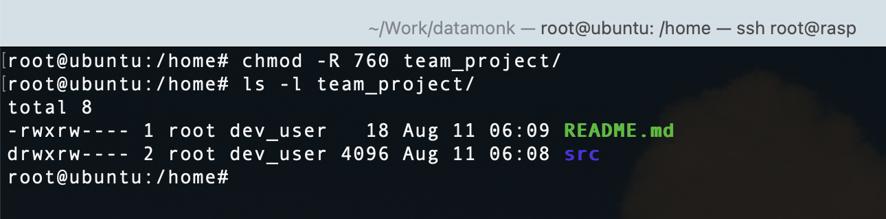
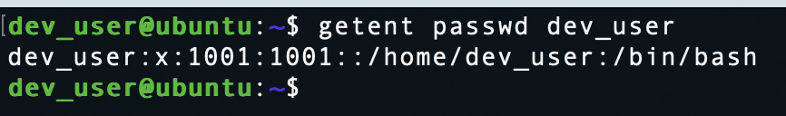
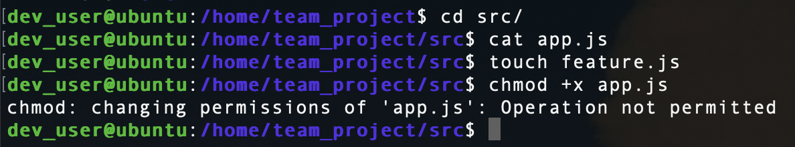

## File vs. Directory Permissions
Execute permission on a directory allows entering and accessing its contents. Without it, even with read permission, you can list names but can’t `cd` into it or open files inside.

## The 777 Risk
On a web server, a PHP file with 777 permissions lets any user (including attackers) modify it. An attacker could inject malicious code, gaining control over the site and possibly the server.

## Symbolic vs. Octal chmod
Symbolic mode (`chmod g+x`) changes only the intended permission without recalculating the entire set, reducing errors and avoiding accidental permission changes.

## sudo’s Power
`sudo rm -rf / temp_files/` treats `/` as root and recursively deletes it before touching `temp_files/`, wiping the system. `sudo` bypasses restrictions, making mistakes irreversible.

## Ownership for Collaboration
Changing group ownership (`chown -R :developers`) lets only the team manage files, keeping permissions tight and scalable, instead of opening access to all users.

---

## Screenshots

### Permissions set with chmod

### dev_user created

### chmod error due to lack of ownership

