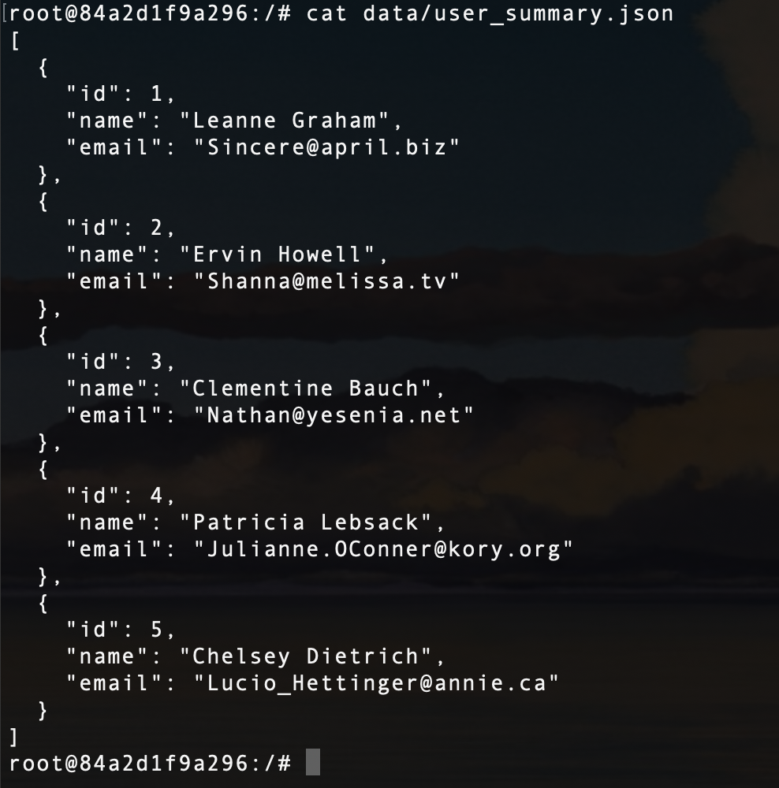
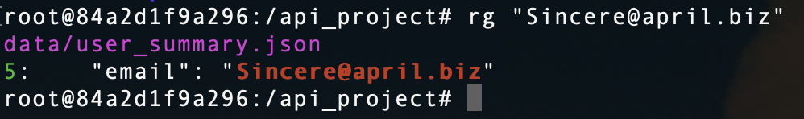
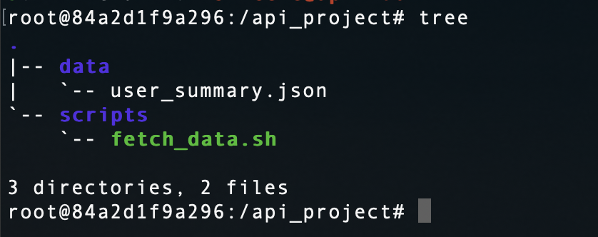

## Package Managers (APT vs. Snap)

Snap provides containerized apps with all dependencies bundled, ensuring consistent behavior across different Linux distributions.  
**Trade-offs**: slower startup times, larger disk usage, and auto-updates that can’t be easily disabled.

## Search Tools (grep vs. ripgrep)

`ripgrep (rg)` is much faster, respects `.gitignore` by default, and recursively searches without extra flags—perfect for large projects.  
`grep` is slower and requires additional options for similar results.

## Internet Utilities (curl vs. wget)

- **curl only**: Sending a JSON POST request to an API.
- **wget better**: Recursively downloading a full website for offline viewing.  
  **Core difference**: curl is optimized for single HTTP requests and API interactions, wget excels in recursive downloads and offline mirroring.

## Practical curl + jq Example

Fetch all public repositories from GitHub with their names and languages:

```bash
curl -s https://api.github.com/users/<username>/repos \
| jq '.[] | {name, language}'
```

---

## Screenshots

### JSON Data



### ripgrep Search



### Project Tree


