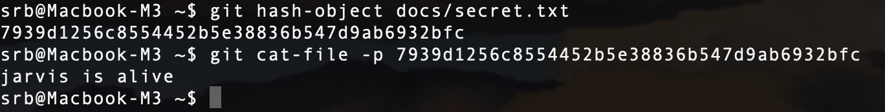
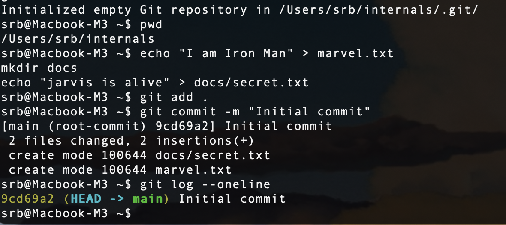
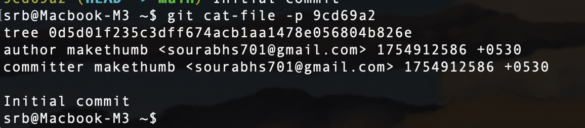
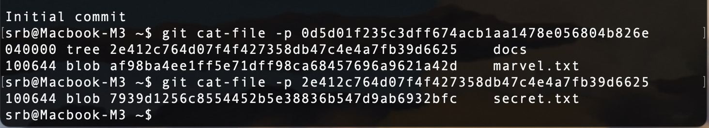

**Secret.txt Blob**
```bash
git hash-object docs/secret.txt
git cat-file -p <hash>
```


## Create a Tree (Commit)
```bash
git commit -m "Initial commit"
git log --oneline
```


## Commit Internals
```bash
git cat-file -p <commit_hash>
```


## Inspect the Tree
```bash
git cat-file -p <tree_hash>
```

