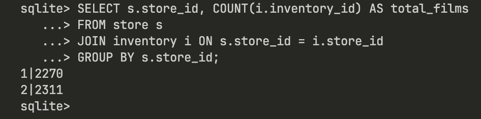
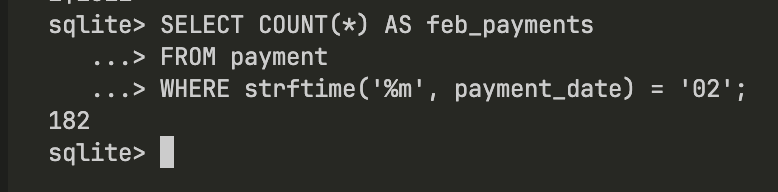
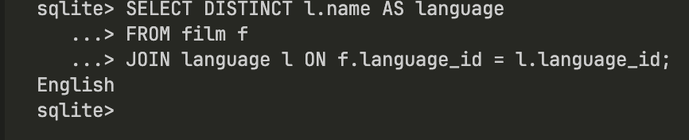
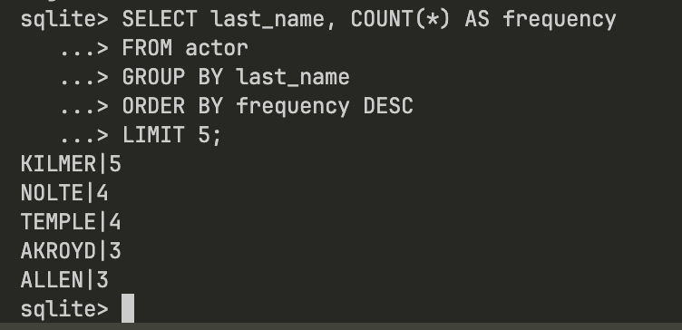
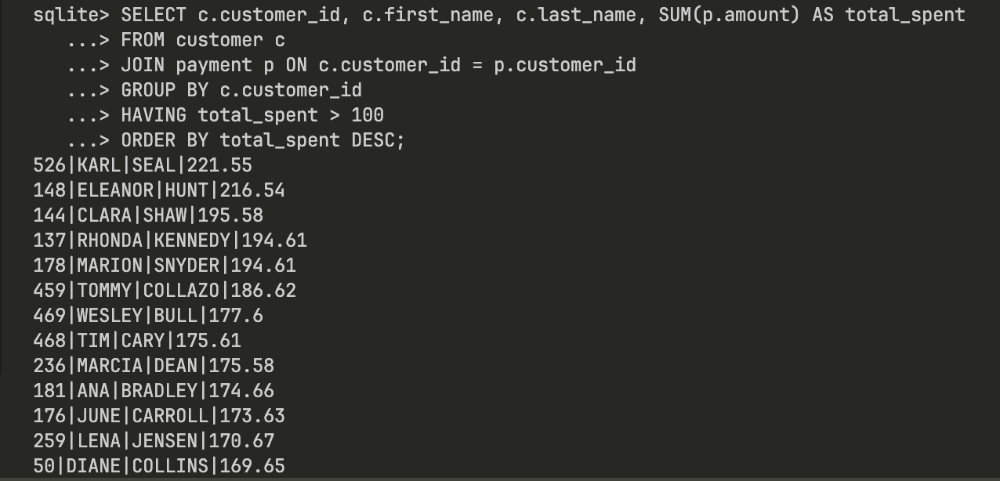

## Q1. List all stores and how many films each has in inventory.

 

```sql
SELECT s.store_id, COUNT(i.inventory_id) AS total_films
FROM store s
JOIN inventory i ON s.store_id = i.store_id
GROUP BY s.store_id;
```

**Screenshot:**  


---

## Q2. What is the total number of payments made in February?

 

```sql
SELECT COUNT(*) AS feb_payments
FROM payment
WHERE strftime('%m', payment_date) = '02';
```

**Screenshot:**  


---

## Q3. Which languages are used in the film catalog?

 

```sql
SELECT DISTINCT l.name AS language
FROM film f
JOIN language l ON f.language_id = l.language_id;
```

**Screenshot:**  


---

## Q4. What are the five most frequently occurring actor last names?

 

```sql
SELECT last_name, COUNT(*) AS frequency
FROM actor
GROUP BY last_name
ORDER BY frequency DESC
LIMIT 5;
```

**Screenshot:**  


---

## Q5. Which customers have spent more than $100 in total payments?

 

```sql
SELECT c.customer_id, c.first_name, c.last_name, SUM(p.amount) AS total_spent
FROM customer c
JOIN payment p ON c.customer_id = p.customer_id
GROUP BY c.customer_id
HAVING total_spent > 100
ORDER BY total_spent DESC;
```

**Screenshot:**  


---
