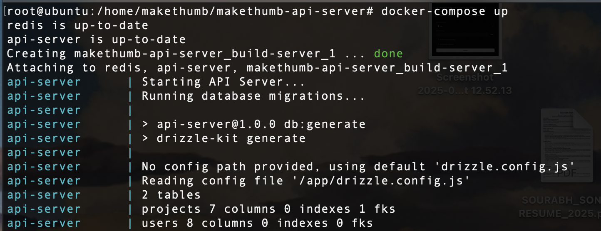
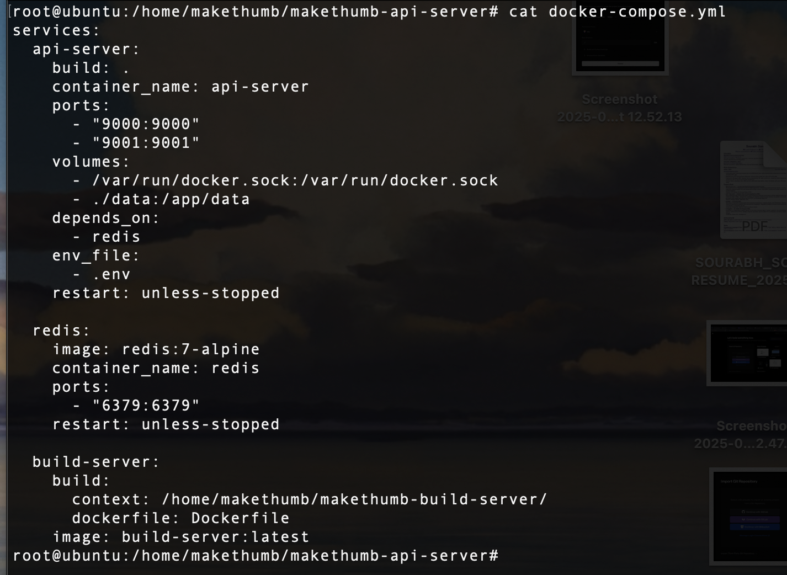

## Docker Compose Setup

### docker-compose.yml
The `docker-compose.yml` defines the services used in this project:

```yaml
services:
  api-server:
    build: .
    container_name: api-server
    ports:
      - "9000:9000"
      - "9001:9001"
    volumes:
      - ./data:/app/data
    depends_on:
      - redis
    env_file:
      - .env
    restart: unless-stopped

  redis:
    image: redis:7-alpine
    container_name: redis
    ports:
      - "6379:6379"
    restart: unless-stopped

  build-server:
    build:
      context: /home/makethumb/makethumb-build-server/
      dockerfile: Dockerfile
    image: build-server:latest
```

---

## Running the Project

To start all services:
```bash
docker-compose up 
```

---

## Screenshots

### ✅ Successful Docker-Compose Run


### 📄 docker-compose.yml Configuration

