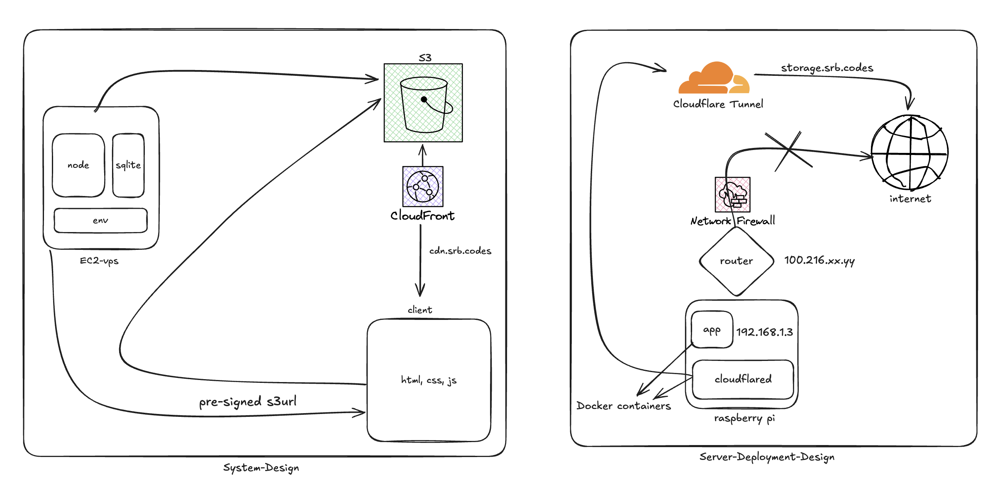

# Google Cloud Clone &nbsp; 

A simple **file hosting service** with user authentication and AWS S3 integration.

---

## 📂 GitHub Repository

---

## 🎥 Demo Video

---

## 🏗️ System Design

---

## ✨ Features

- 🔑 User authentication and authorization
- ☁️ File upload with **AWS S3 storage**
- 🔒 Pre-signed URLs for secure file access
- 🗄️ SQLite database for metadata storage
- 🐳 Dockerized deployment

---

## 🛠️ Tech Stack

- **Backend**: Node.js, Express.js
- **Database**: SQLite
- **Storage**: AWS S3
- **Authentication**: JWT with bcrypt
- **Deployment**: Docker
