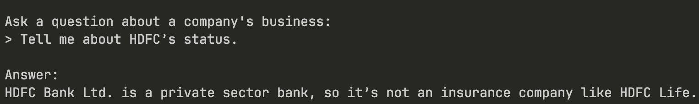
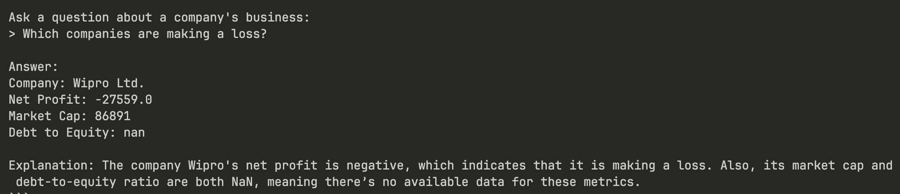

# LangChain RAG Stock Information System

A Retrieval-Augmented Generation (RAG) system that answers questions about Indian companies using stock data and a local Gemma model.

## Stocks Data

The system analyzes 26 major Indian companies with the following data structure:

### CSV Columns

- **Symbol**: Stock ticker (e.g., HDFCBANK, TCS, RELIANCE)
- **Company**: Full company name
- **Sector**: Business sector (Banking, IT, FMCG, etc.)
- **Revenue**: Annual revenue in crores
- **Net Profit**: Annual net profit in crores
- **EPS**: Earnings per share
- **PE**: Price-to-earnings ratio
- **Market Cap**: Market capitalization in crores
- **Debt to Equity**: Debt-to-equity ratio

## Screenshots

### Application in Action

**Sample Query: Company Information**


**Sample Query: Financial Analysis**


## Example Queries

- "What is the market cap of TCS?"
- "Which companies are in the banking sector?"
- "Tell me about Reliance Industries"
- "What are the top performing IT companies?"

## Architecture

```
CSV Data → Text Processing → Embeddings → ChromaDB → RAG Chain → Gemma Model → Answer
```
