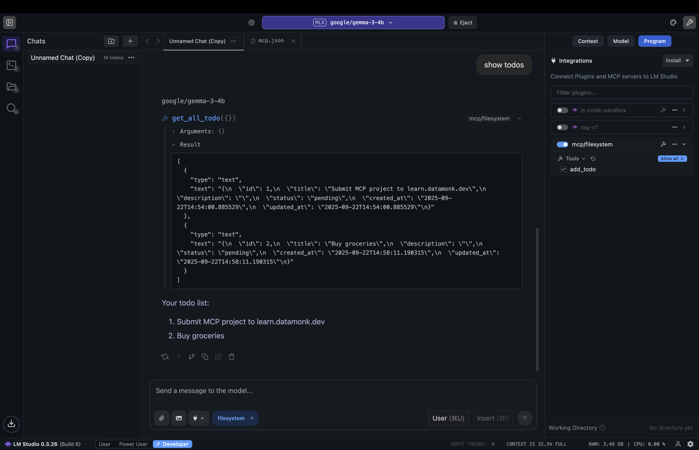
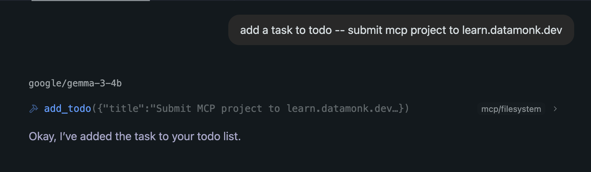
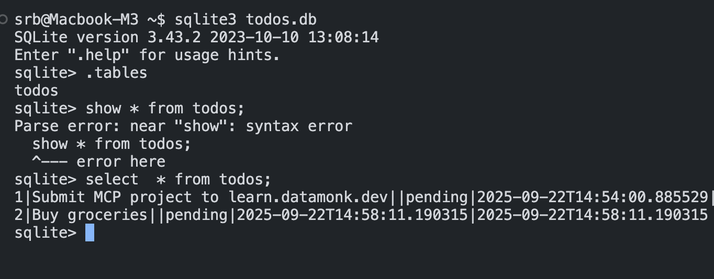

# Todo MCP Server

A simple Model Context Protocol (MCP) server for managing todos with SQLite database.

## Features

- Add new todos with title and description
- Retrieve all todos from database
- SQLite backend for data persistence

## Usage

Run the server:

```bash
python main.py
```

The server provides two tools:

- `add_todo(title, description)` - Add a new todo
- `get_all_todo()` - Get all todos

## Screenshots

### LM Studio Interface



### Adding Todo from LM Studio



### Todos from Database


