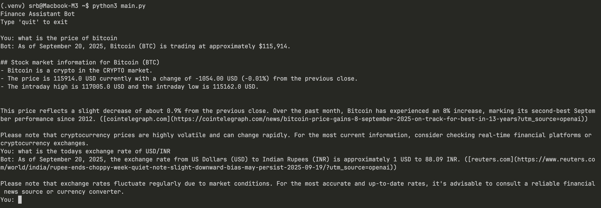

# Finance Bot CLI

A minimal finance bot that can provide real-time information about stocks, cryptocurrencies, exchange rates, and company news using OpenAI function calling and web search.

## Features

- 📈 **Stock Prices**: Get current stock prices (e.g., "What's Apple stock price?")
- 🪙 **Cryptocurrency**: Check crypto prices (e.g., "Bitcoin price today")
- 💱 **Exchange Rates**: Currency conversion rates (e.g., "USD to EUR rate")
- 📰 **Company News**: Latest financial news about companies

## Usage Examples

- "What's the current price of Bitcoin?"
- "Apple stock price today"
- "Exchange rate from USD to INR"
- "Latest news about Tesla"
- "How much is Ethereum worth?"

## How It Works

1. **User Input**: You ask a finance-related question
2. **AI Analysis**: The bot analyzes your question and decides which tool to use
3. **Web Search**: The appropriate function searches the web for real-time data
4. **Response**: The bot provides you with current, accurate information

Type `quit` to exit the bot.

