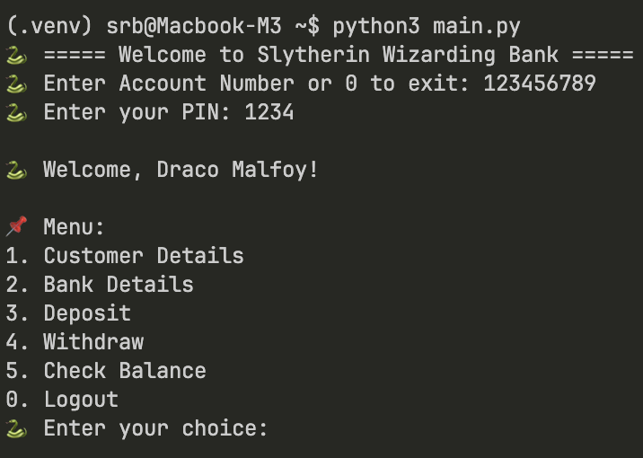
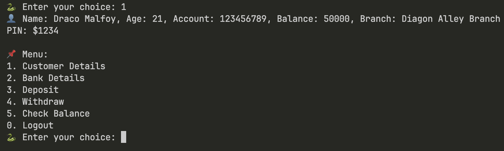
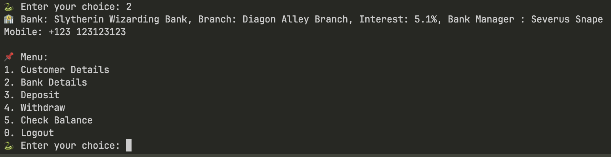
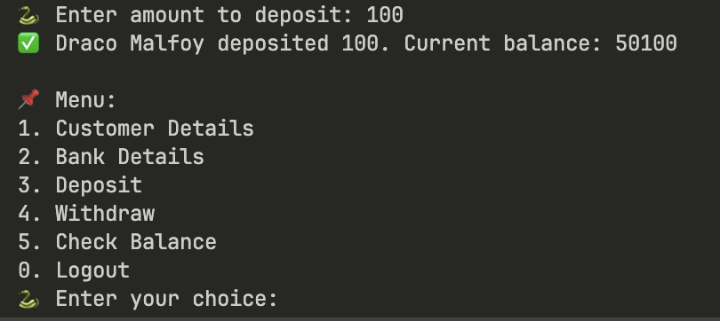
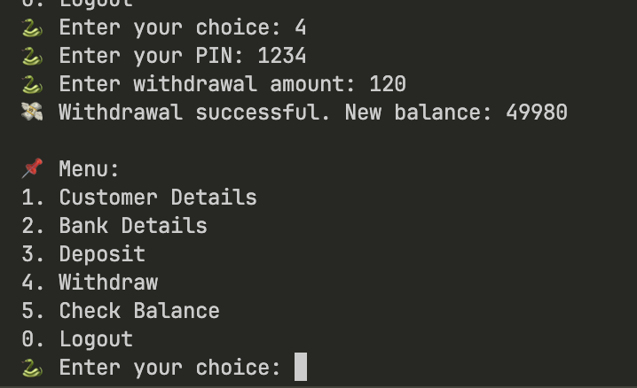
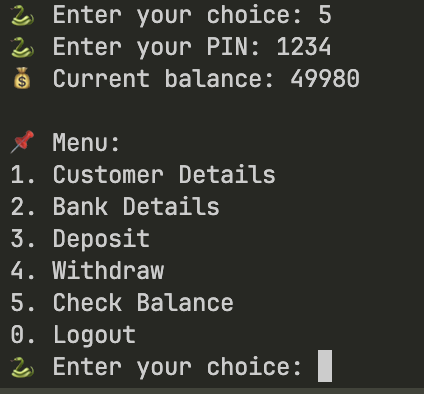
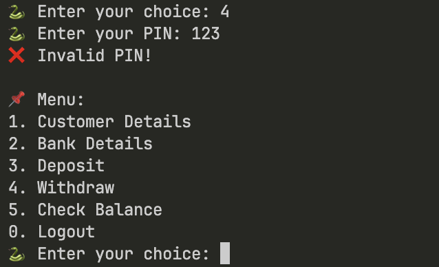

# Basic Banking System

A Python-based banking system that demonstrates object-oriented programming concepts, decorators, and inheritance.

## Class Methods

### Core Methods

- `__init__` - Constructor for initializing bank accounts
- `deposit` - Add funds to account
- `withdraw` - Remove funds from account (protected by PIN verification)
- `check_balance` - View current balance (protected by PIN verification)
- `verify_pin` - PIN validation logic

### Information Methods

- `customer_details` - Display customer information (overridden by Bank_v2)
- `bank_details` - Display bank information (overridden by Bank_v2)

### Utility Methods

- `verify_pin_decorator` - Verification middleware decorator
- `get_int_value` - Static method for getting integer input from user

## Screenshots

### Login Interface



### Customer Details



### Bank Details



### Deposit Functionality



### Withdraw Functionality



### Balance Check



### Invalid PIN Error



## Project Structure

```
python_mini_project/
├── main.py              # Main application entry point
├── bank_system.py       # Core banking system implementation
├── README.md            # This documentation
└── screenshots/         # Application screenshots
    ├── login.png
    ├── customer_det.png
    ├── bank_det.png
    ├── deposit.png
    ├── withdraw.png
    ├── check_balance.png
    └── invaild_pin.png
```