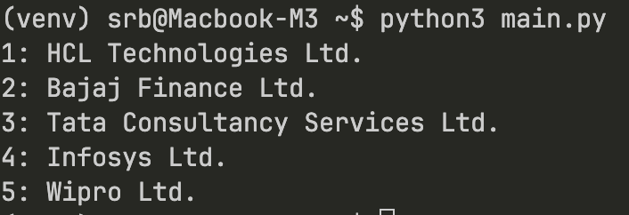

# Semantic Stock Recommendation System

A Python bot that finds relevant stocks using semantic search. Enter any business description and get matching companies from NSE.

## Query: Software companies 


## What it does

- Loads NSE company data into a vector database
- Uses AI embeddings to understand business descriptions
- Finds most relevant stocks based on your query

## How to run

```bash
# Install dependencies
pip install pandas chromadb sentence-transformers

# Run the bot
python3 main.py
```

