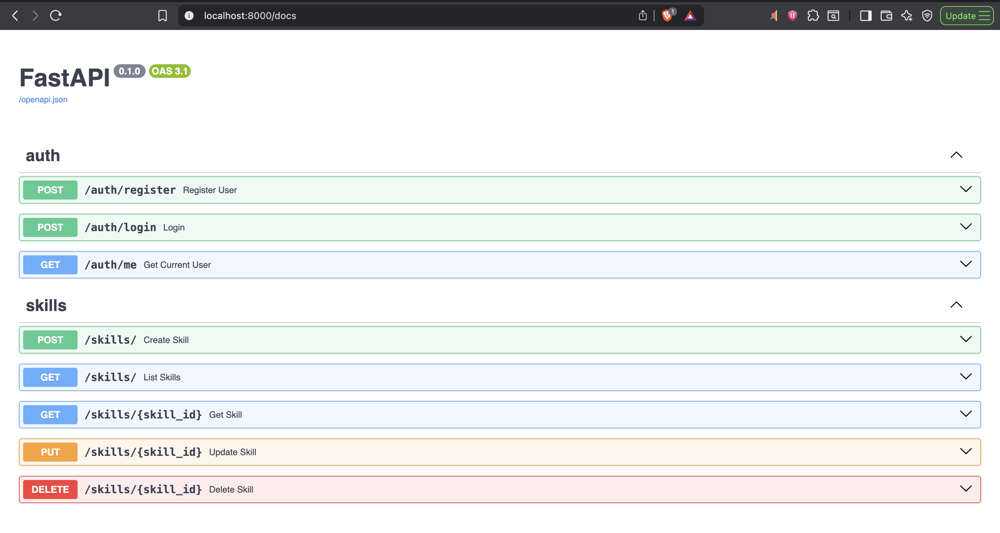

## SkillShare API

Simple FastAPI backend for user authentication and managing multiple user skills.

### Tech stack

- FastAPI
- SQLModel
- PyJWT (JWT auth)
- Passlib (bcrypt)
- Uvicorn
- psycopg2

### Setup

1. Create and activate a virtualenv (optional)
2. Install dependencies:
   pip install -r requirements.txt
3. Initialize database (auto on first run). Start the server:
   uvicorn app.main:app --reload

Optional env vars:

- JWT_SECRET_KEY (default: devsecret)
- JWT_ALGORITHM (default: HS256)
- TOKEN_EXPIRE_MINUTES (default: 30)
- DATABASE_URL

### API endpoints

- Auth
  - POST /auth/register → Register and receive token
  - POST /auth/login → Login and receive token
  - GET /auth/me → Get current user (Bearer token)
- Skills (Bearer token required)
  - POST /skills → Create a skill
  - GET /skills → List my skills
  - GET /skills/{skill_id} → Get a skill
  - PUT /skills/{skill_id} → Update a skill
  - DELETE /skills/{skill_id} → Delete a skill

### Deployment URL

- Render/Railway: https://datamonk_skill_share_api.onrender.com

### Screenshots

